# Laboratorio - Escalamiento en Azure con Azure Functions

## Escuela Colombiana de Ingeniería

### Arquitecturas de Software - ARSW

### Autores:

1. María Paula Sánchez Macías

2. Juan Esteban Medina Rivas

---

## Parte 1: Creación de Function App

> Creamos una Function App desde el portal de Azure con las siguientes configuraciones:

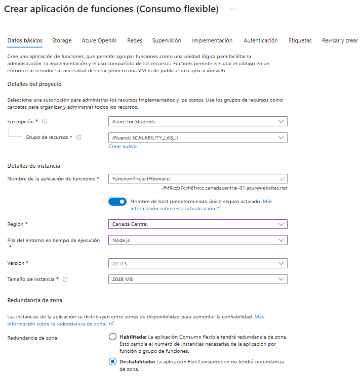

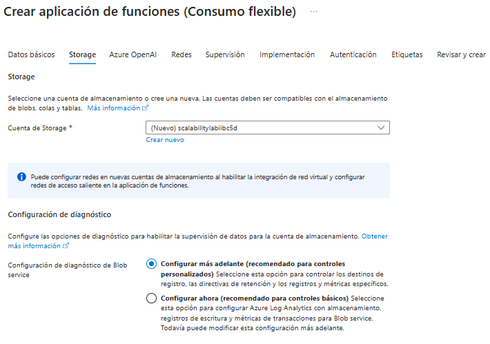

**Configuración utilizada:**

- **Suscripción:** Azure for Students
- **Grupo de recursos:** SCALABILITY_LAB_II
- **Nombre:** FunctionProjectFibonacci
- **Región:** Canada Central
- **Runtime stack:** Node.js
- **Versión:** 22 LTS
- **Plan:** Consumption (Serverless)

---

## Parte 2 y 3 : Instalación de extensión Azure Functions y Despliegue de la función Fibonacci

> Instalamos la extensión de Azure Functions para Visual Studio Code desde el marketplace.

> Desplegamos la función Fibonacci a Azure usando Visual Studio Code. Al hacer el despliegue por primera vez, el sistema nos pidió autenticarnos.

---

## Parte 4: Pruebas de la función en Azure Portal

> Nos dirigimos al portal de Azure y probamos la función con diferentes valores:

### Prueba con nth=10

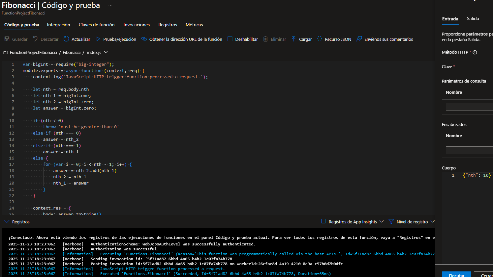

**Resultado:**

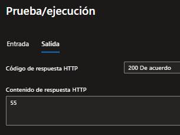

**Tiempo:** 65ms

### Prueba con nth=1000000

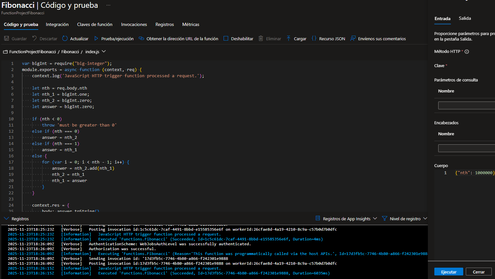

**Resultado:**

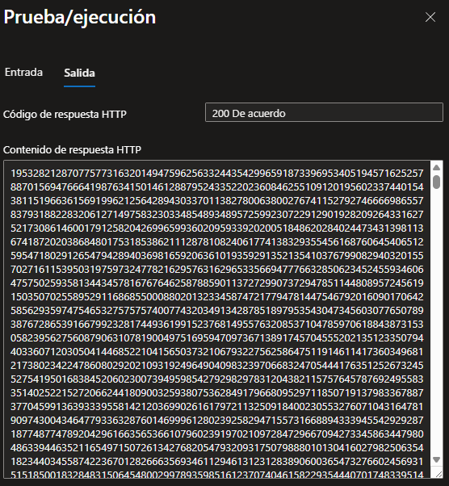

**Tiempo:** 6035ms

**Observación:** Para valores grandes, el tiempo de ejecución aumenta considerablemente debido a la complejidad del algoritmo iterativo.

---

## Parte 5: Pruebas de concurrencia con Newman

> Modificamos la colección de Postman con Newman para enviar 10 peticiones concurrentes.

### Configuración del archivo de prueba

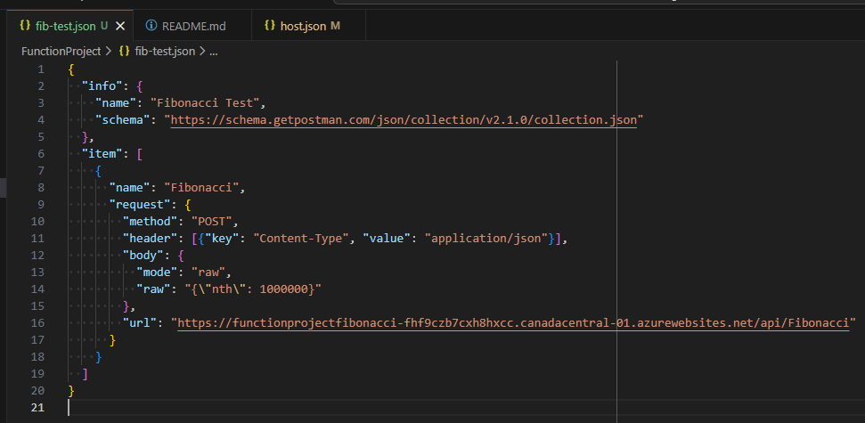

### Ejecución de pruebas concurrentes

> Ejecutamos las pruebas con el comando:

```powershell
1..10 | ForEach-Object { Start-Job { newman run fib-test.json } }
```

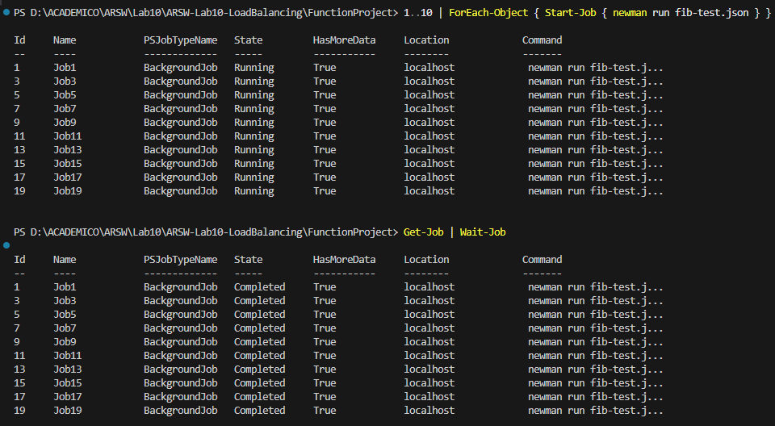

### Métricas obtenidas

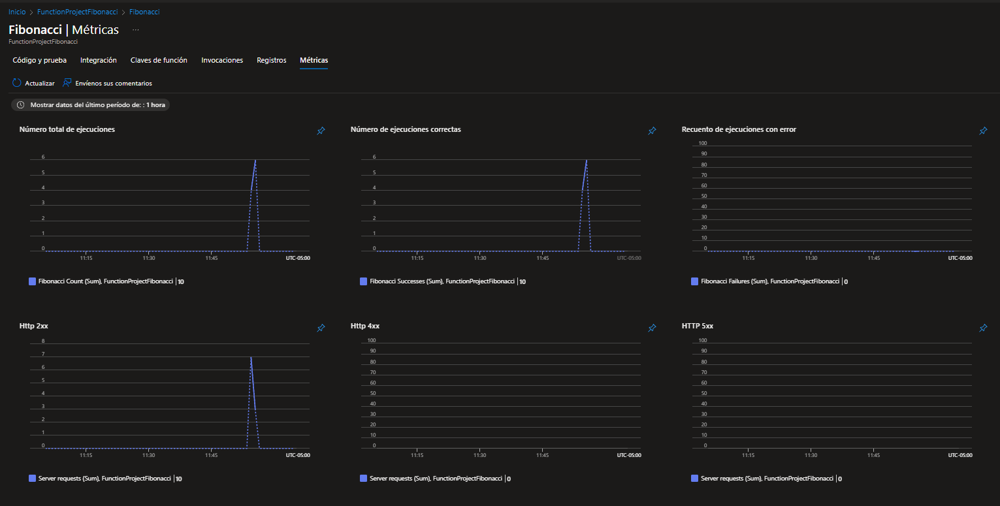

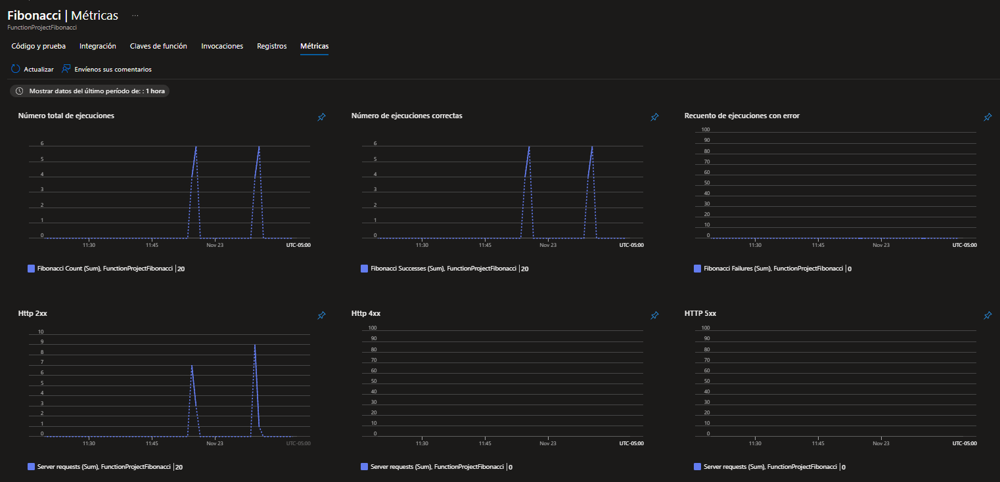

**Resultados observados:**

- **Total de ejecuciones:** 20 peticiones
- **Ejecuciones exitosas:** 20 (100% de éxito)
- **Ejecuciones fallidas:** 0
- **HTTP 2xx:** 20 (todas las peticiones respondieron con código 200)

### Consumo de CPU

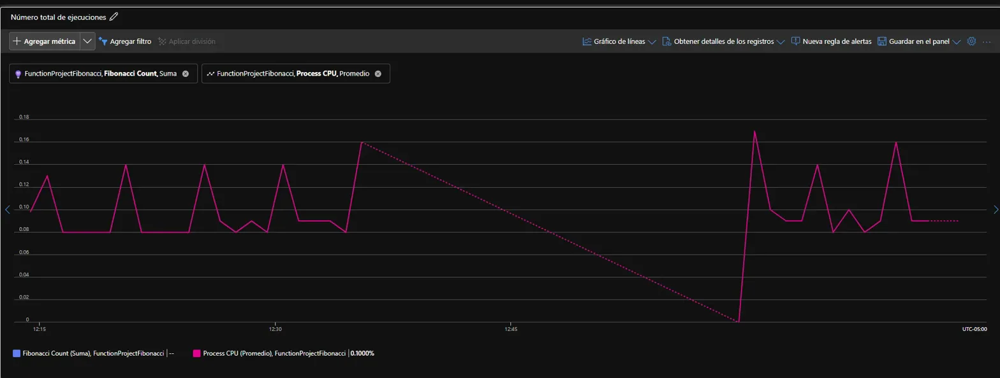

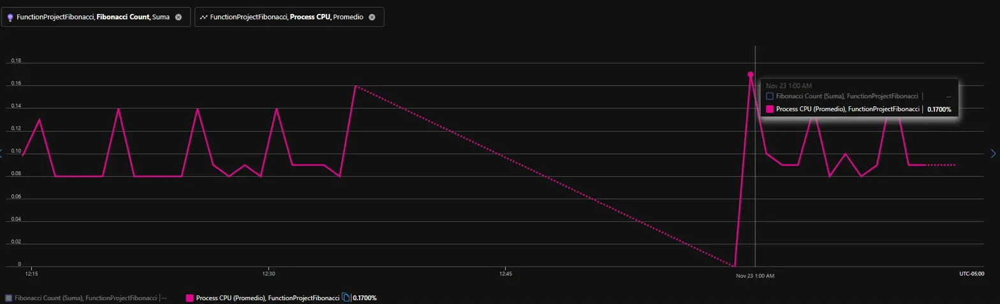

**Análisis del consumo de CPU:**

- El CPU se mantuvo consistentemente **por debajo del 0.2%** durante todas las pruebas
- **CPU Máximo observado:** 0.17% (durante las pruebas de carga con Newman)
- **CPU Promedio:** ~0.1%
- El sistema cumplió ampliamente con el requisito de no superar el **70% de CPU**

**Conclusión del punto 5:**
El sistema manejó correctamente las 10 peticiones concurrentes sin problemas de rendimiento. El consumo de CPU fue extremadamente bajo (máximo 0.17%), muy por debajo del límite establecido del 70%. Esto indica que la arquitectura serverless de Azure Functions escaló adecuadamente para manejar la carga sin estrés en los recursos del sistema.

---

## Parte 6: Función con Memoization

> Creamos una nueva función llamada FibonacciMemo que implementa el cálculo de Fibonacci usando recursión con memoization.

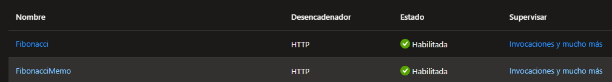

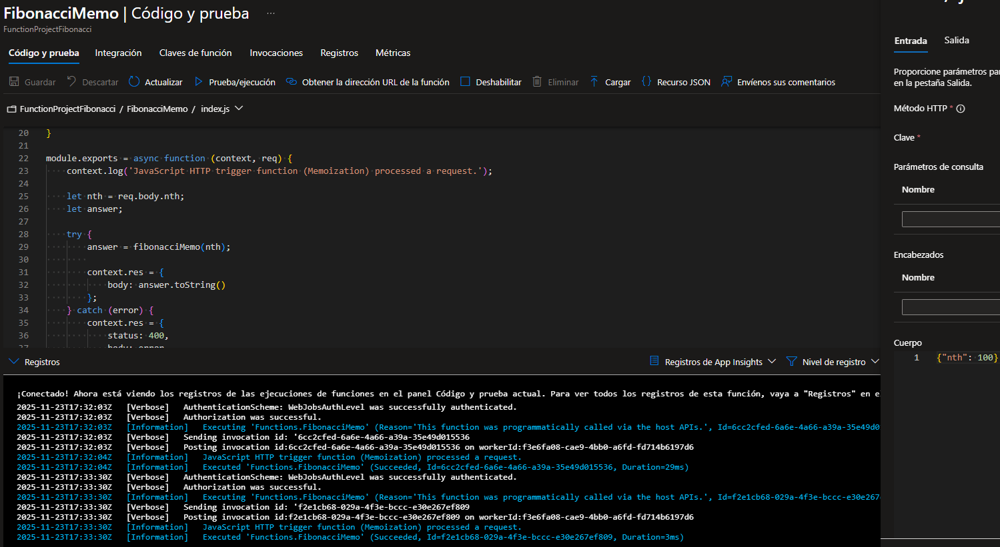

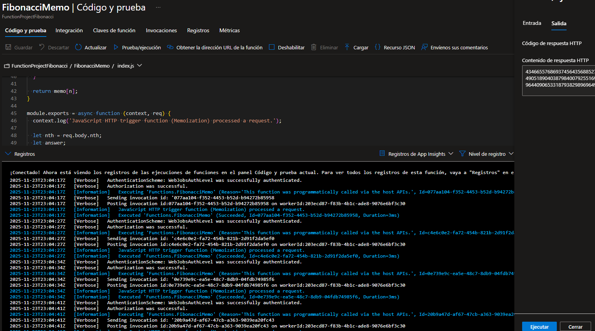

**Tiempo de ejecución:** 29ms

### Segunda ejecución (después de ~1.5 minutos)

**Tiempo de ejecución:** 3ms

La memoization solo es efectiva dentro del ciclo de vida de una instancia
específica. Para un caché persistente y compartido, se requeriría un servicio
externo como Azure Cache for Redis.

**Análisis del comportamiento:**

La función con memoization mostró una mejora significativa en el rendimiento después de la primera ejecución (de 29ms a 3ms). El caché en memoria se mantuvo activo incluso después de 10 minutos de inactividad, lo que indica que la instancia de Azure Functions se mantuvo "caliente" (warm).

**¿Por qué la memoization funcionó en nuestro caso?**
La instancia de la función permaneció activa (warm) durante nuestras pruebas, manteniendo el caché global `memo` en memoria entre invocaciones.

**¿Cuándo puede fallar la memoization en Azure Functions?**

1. Después de aproximadamente 20 minutos de inactividad completa, Azure "enfría" la instancia y el caché se pierde por completo.

2. Múltiples instancias. Cada instancia tiene su propio caché separado que no se comparte con las demás.

3. Cualquier despliegue, actualización o fallo del sistema reinicia las instancias, perdiendo toda la memoria cache.

---

## Preguntas

### ¿Qué es un Azure Function?

### ¿Qué es serverless?

### ¿Qué es el runtime y qué implica seleccionarlo al momento de crear el Function App?

### ¿Por qué es necesario crear un Storage Account de la mano de un Function App?

### ¿Cuáles son los tipos de planes para un Function App?, ¿En qué se diferencian?, mencione ventajas y desventajas de cada uno de ellos.

### ¿Por qué la memoization falla o no funciona de forma correcta?

### ¿Cómo funciona el sistema de facturación de las Function App?

---

## Autores

- [Nombre del estudiante]
- [Nombre del compañero]

**Fecha:** Noviembre 2025
